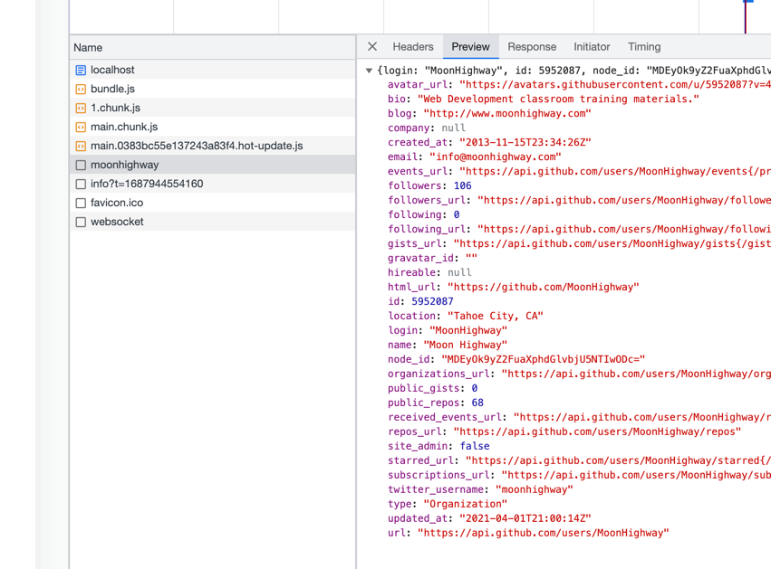
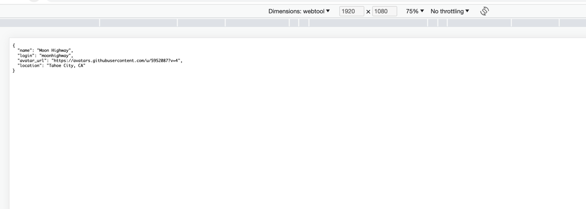

## リクエストの認証

```tsx  
import React, { useEffect, useState } from "react";

function GitHubUser({ login }) {
  const [data, setData] = useState();

  useEffect(() => {
    if (!login) return;
    fetch(`https://api.github.com/users/${login}`)
      .then((response) => response.json())
      .then(setData)
      .catch(console.error);
  }, [login]);

  //初回描画時には、ステート data が未取得な
  // ので、描画関数は null を返します。コンポーネントの描画関数が null を返した場合、React は
  // 何も描画しません。

  // 単純にデータを JSON.stringify で文字列
  // に変換して<pre> 要素のテキスト値として設定しています
  // それにより、デフォルトの変換処理が施され、出力される JSON 文字列はス
  // ペース 2 個でインデントされます
  if (data) return <pre>{JSON.stringify(data, null, 2)}</pre>;

  return null;
}

export default function App() {
  // ユーザーのログイン ID（"moonhighway" ）を login プロパティに指定し
  // て GitHubUser コンポーネントを描画しています
  return <GitHubUser login="moonhighway" />;
}
```


## データの保存


```tsx
import React, { useState, useEffect } from "react";

const loadJSON = key => key && JSON.parse(localStorage.getItem(key));
const saveJSON = (key, data) => localStorage.setItem(key, JSON.stringify(data));

function GitHubUser({ login }) {

  // loadJSON は同期関数なので、上記のように useState の引数指定時に同期的に呼び
  const [data, setData] = useState(loadJSON(`user:${login}`));

  useEffect(() => {
    if (!data) return;
    const { name, avatar_url, location } = data;
    // 新しいデータが GitHub からロードされた場合、saveJSON を呼び出して保存しています。
    // ここで必要なフィールド、つまり name、login、avatar_url、そして location のみを保存してい
    // る点に注目してください。
    saveJSON(`user:${login}`, {
      name,
      login,
      avatar_url,
      location
    });
  }, [data]);

  useEffect(() => {
    if (!login) return;
    
    // ローカルで保存された場合はスキップ
    if (data && data.login === login) return;
    fetch(`https://api.github.com/users/${login}`)
      .then(response => response.json())
      .then(setData)
      .catch(console.error);
  }, [login]);

  if (data) return <pre>{JSON.stringify(data, null, 2)}</pre>;

  return null;
}

export default function App() {
  return <GitHubUser login="moonhighway" />;
}
```

### 初回


```
useEffect login end
useEffect login end
useEffect login
useEffect data start data[object Object]
useEffect data end
```

### 2回目



## 非同期リクエストの状態管理

```tsx
import React, { useState, useEffect } from "react";

function GitHubUser({ login }) {
  const [data, setData] = useState();
  const [error, setError] = useState();
  const [loading, setLoading] = useState(false);

  useEffect(() => {
    console.log("useEffect start")
    if (!login) return;

    console.log("login is not null ,useEffect fetch user")

    //リクエストが保留中の状態では、単純に「ローディング中」のメッセージを表示しています。
    setLoading(true);
    fetch(`https://api.github.com/users/${login}`)
      .then(data => data.json())
      .then(setData)
      .then(() => setLoading(false))
      .catch(setError);
  }, [login]);

  console.log("loading : " + loading)
  console.log("data : " + data)

  if (error) return <pre>{JSON.stringify(error, null, 2)}</pre>;
  if (loading) return <h1>loading...</h1>;
  if (!data) return null;

  console.log("data is not null : data.name = " + data.name)

  return (
    <div className="githubUser">
      
      <div>
        <h1>{data.login}</h1>
        {data.name && <p>{data.name}</p>}
        {data.location && <p>{data.location}</p>}
      </div>
    </div>
  );
}

export default function App() {
  return <GitHubUser login="moonhighway" />;
}
```


>HTTP リクエストおよび Promise は、必ず 3 つの状態をとる 
ので、再利用可能なフックもしくはコンポーネント、それに加えて React の提供するサスペンス （Suspense）で処理することが可能です。


log
```
App.js:24 data : undefined
App.js:23 loading : false
App.js:24 data : undefined
App.js:9 useEffect start
App.js:12 login is not null ,useEffect fetch user
App.js:23 loading : true
App.js:24 data : undefined
App.js:23 loading : true
App.js:24 data : undefined
App.js:23 loading : true
App.js:24 data : [object Object]
App.js:23 loading : true
App.js:24 data : [object Object]
App.js:23 loading : false
App.js:24 data : [object Object]
App.js:30 data is not null : data.name = Moon Highway
App.js:23 loading : false
App.js:24 data : [object Object]
App.js:30 data is not null : data.name = Moon Highway
```
### レンダープロップ

>レンダープロップはコンポーネントの再利用のためのパターンです
> つまり、コンポーネン   
>トの描画内容をプロパティ経由で他のコンポーネントに渡すことを指します。
> React 要素の場合もあれば、React 要素を返す関数の場合もあります。  
> 後者の場合、レン ダープロップを受け取ったコンポーネントは、データを引数として渡すことでレンダープロップを 実行し、**返却された要素**を描画します。


####  レンダープロップ
```tsx

// つまり、コンポーネン 
// トの描画内容をプロパティ経由で他のコンポーネントに渡すことを指し 

// 先頭のプロ 
// パティ data は描画対象となる配列で、デフォルトは空の配列です。
// 2 番目のプロパティ render  Empty は配列が空の場合に描画される React 要素です

// renderEmpty は特定の条件に当てはまる場合に描画されるレンダープロップです

function List({ data = [], renderEmpty }) {
  if (!data.length) return renderEmpty;
  return <p>{data.length} items</p>;
}

export default function App() {
  return <List renderEmpty={<p>This list is empty</p>} />;
}
```

####  fix
```tsx
import React from "react";

const tahoe_peaks = [
  { name: "Freel Peak", elevation: 10891 },
  { name: "Monument Peak", elevation: 10067 },
  { name: "Pyramid Peak", elevation: 9983 },
  { name: "Mt. Tallac", elevation: 9735 }
];

function List({ data = [], renderItem, renderEmpty }) {
  return !data.length ? (
    renderEmpty
  ) : (
    <ul>
      {data.map((item, i) => (
        <li key={i}>{renderItem(item)}</li>
      ))}
    </ul>
  );
}

export default function App() {
  return (

// レンダープロップ renderItem は関数で
// name と elevation の各フィールドを React フラグメントに描画して返却しています。

// renderEmpty は特定の条件に当てはまる場合に描画されるレンダープロップです

    <List
      data={tahoe_peaks}
      renderEmpty={<p>This list is empty</p>}
      renderItem={item => (
        <>
          {item.name} - {item.elevation.toLocaleString()}
        </>
      )}
    />
  );
}
```
```
Freel Peak - 10,891
Monument Peak - 10,067
Pyramid Peak - 9,983
Mt. Tallac - 9,735
```


### 仮想リスト

>描画は処理時間、CPU パワー、メモリ等、多くのリソースを消費します。

```tsx

import React from "react";
import faker from "faker";

const bigList = [...Array(5000)].map(() => ({
  name: faker.name.findName(),
  email: faker.internet.email(),
  avatar: faker.internet.avatar()
}));

function List({ data = [], renderItem, renderEmpty }) {
  return !data.length ? (
    renderEmpty
  ) : (
    <ul>
      {data.map((item, i) => (
        <li key={i}>{renderItem(item)}</li>
      ))}
    </ul>
  );
}

export default function App() {
  const renderItem = item => (
    <div style={{ display: "flex" }}>
      
      <p>
        {item.name} - {item.email}
      </p>
    </div>
  );

  return <List data={bigList} renderItem={renderItem} />;
}
```


```tsx
import React from "react";
import { FixedSizeList } from "react-window";
// import faker from "faker";
import { faker } from '@faker-js/faker';

const bigList = [...Array(5000)].map(() => ({
  name: faker.person.fullName(),
  email: faker.internet.email(),
  avatar: faker.internet.avatar()
}));

export default function App() {
  const renderRow = ({ index, style }) => (
    <div style={{ ...style, ...{ display: "flex" } }}>
      
      <p>
        {bigList[index].name} - {bigList[index].email}
      </p>
    </div>
  );

  // 今回は一度にすべてのユーザーが描画されるのではなく、必要な数だけしか描画されていませ ん。

  return (
    <FixedSizeList
      height={window.innerHeight}
      width={window.innerWidth - 20}
      itemCount={bigList.length}
      itemSize={50}
    >
      {renderRow}
    </FixedSizeList>
  );
}
```

### useFetch フック, Fetch コンポーネント

>描画は処理時間、CPU パワー、メモリ等、多くのリソースを消費します。

* アプリケーションで fetch API を使ってリクエスト 
を送信するたびに、これらの状態を管理するコードを繰り返し書くことになるので、ここで再利用 
可能なカスタムフックを実装しましょう。

* ロード中に表示されるアイコン 
は、コンポーネントごとに異なっている必要はなく、アプリケーションで共通のアイコンを表示す ればいいのです。また、エラーが発生した場合の処理方法も、通常はアプリケーション内で共通 です。


```tsx 
// app.ts


import React from "react";
import Fetch from "./Fetch";

function GitHubUser({ login }) {
  return (
    <Fetch
      uri={`https://api.github.com/users/${login}`}
      loadingFallback="loading" // カスタムUI（ロード中）
      renderError={error => {
        // handle erro
          // カスタムUI（エラー時）
        return <p>Something went wrong... {error.message}</p>;
      }}
      renderSuccess={({ data }) => (
        <>
          <h1>Todo: Render UI for data</h1>
          <pre>{JSON.stringify(data, null, 2)}</pre>
        </>
      )}
    />
  );
}

export default function App() {
  // login が変更されるびに useFetch の引数 uri が更新されるので、結果的に fetch リ 
// クエストが呼び出され、GitHubUser コンポーネントが再描画されます。
  return <GitHubUser login="moonhighway" />;
}
```


```tsx
// fetch.ts
import React, { useState, useEffect } from "react";

function useFetch(uri) {
  const [data, setData] = useState();
  const [error, setError] = useState();
  const [loading, setLoading] = useState(true);

  useEffect(() => {
    if (!uri) return;
    fetch(uri)
      .then(data => data.json())
      .then(setData)
      .then(() => setLoading(false))
      .catch(setError);
  }, [uri]);

  return {
    loading,
    data,
    error
  };
}

// クエスト保留中に描画される loadingFallback と、 
// リクエスト成功した場合に呼び出される renderSuccess、そしてリクエスト失敗した場合に呼び 
// 出される renderError です。renderSuccess 以外のレンダープロップはデフォルト引数が記述 
// されているため、省略可能です

export default function Fetch({
  uri,
  renderSuccess,
  loadingFallback = <p>loading...</p>,
  renderError = error => <pre>{JSON.stringify(error, null, 2)}</pre>
}) {
  const { loading, data, error } = useFetch(uri);
  if (error) return renderError(error);
  if (loading) return loadingFallback;
  if (data) return renderSuccess({ data });
}

```
